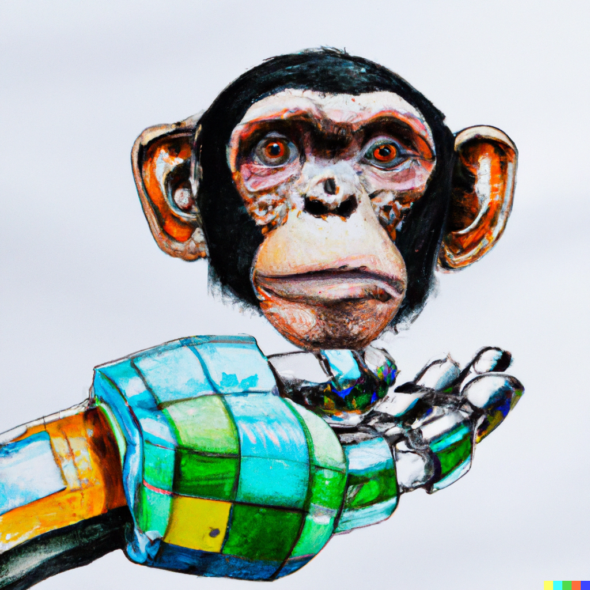

# dl_curriculum
Attempted solutions to Jacob Hilton's curriculum on aligning language models.

Dall-e prompt *A chimpanzee holds a robot head in his open palm, abstract pencil and watercolor art* produced a robot hoolding a chimpanzee head in its open palm.
